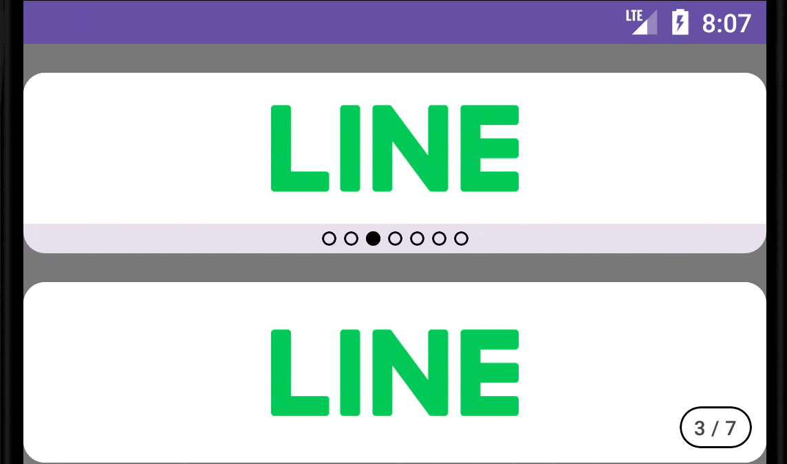
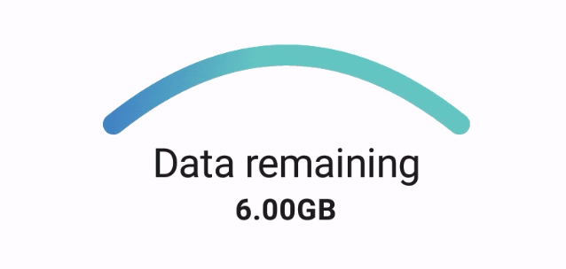

# CuriousUI
This is a project for building Android UI components that have caught my curiosity. It is a work in 
progress!

## Banner
This component was created using a `HorizontalPager`. It is usually used to display adverts of some
sort. Key features of this UI include:
1. automatic scrolling of the page every 2 seconds, unless there is a user interaction, in which 
case automatic scrolling resumes after 3 seconds.
2. option between two types of indicators to represent the page state: the default 'circle' style 
and the 'text' style used when there is insufficient space to accommodate all circles.

## DataUsageArc
This component was created using a `Canvas`. It was inspired by the UI present in the KT app.

|           DataUsageArc           |      Inspiration (KT)      |
|:--------------------------------:|:--------------------------:|
|  |  |